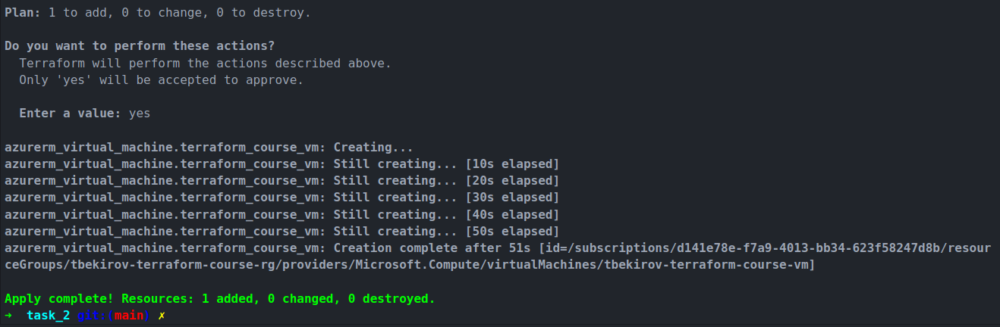
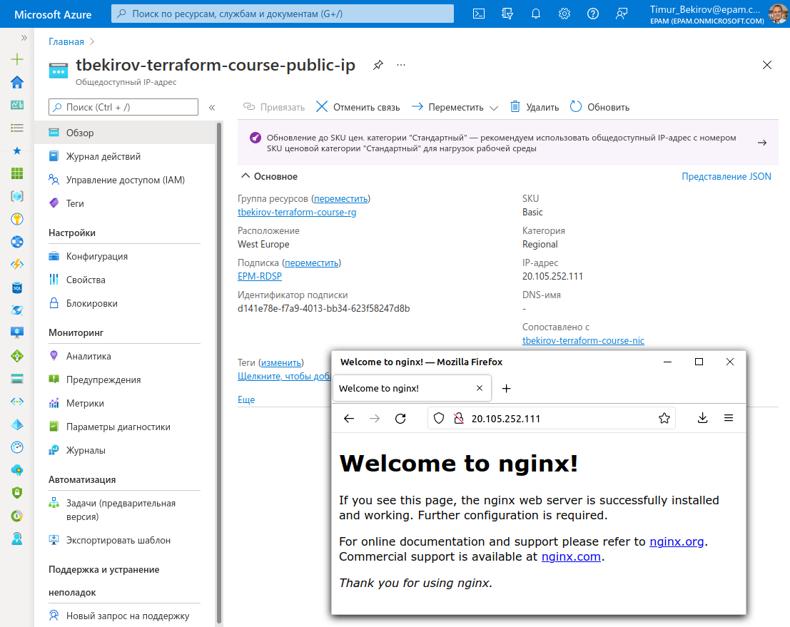
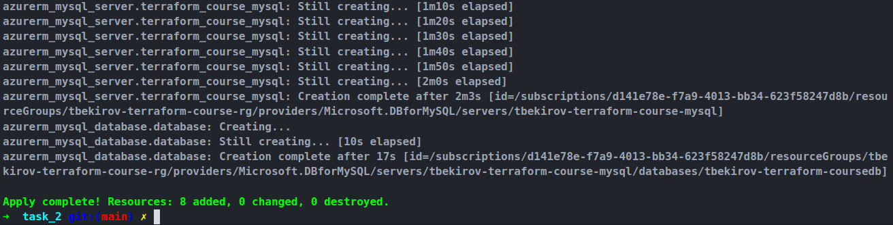
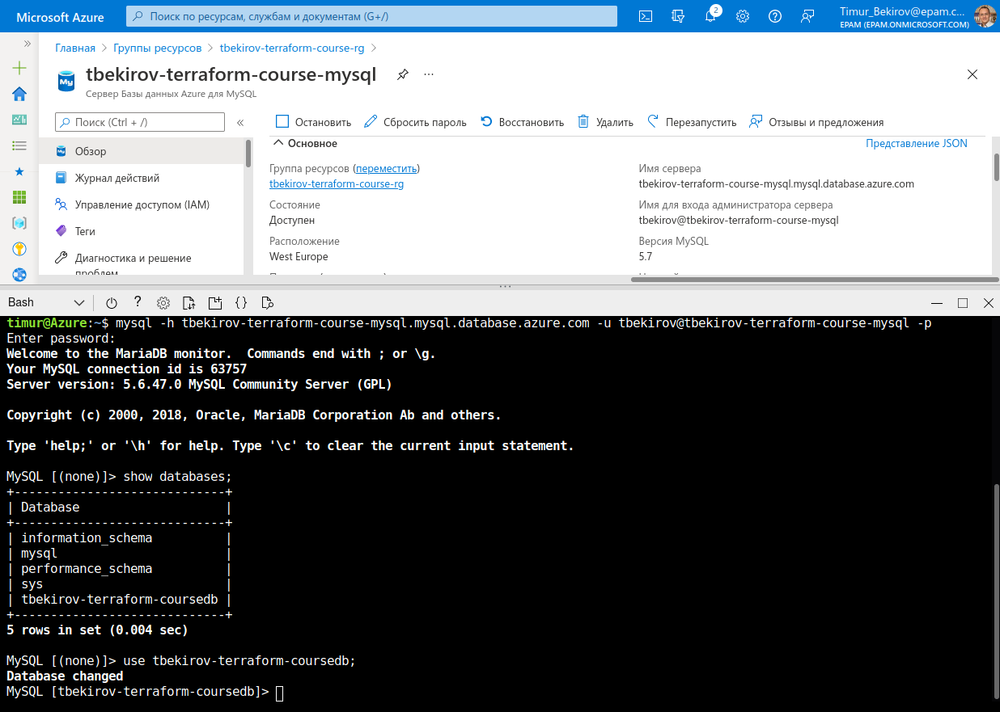

# Terraform. Задание 2.

· Написать terraform манифест для разворачивания AWS EC2/Azure VM. Этот инстанс должен содержать nginx. Nginx должен быть установлен во время провиженинга инстанса, например с помощью user data.

Запускаем:

Проверяем:

· (Дополнительно) Добавить в манифест код для создания базы данных AWS RDS/Azure Database. Тип базы на ваше усмотрение.
Запускаем:

Проверяем:

